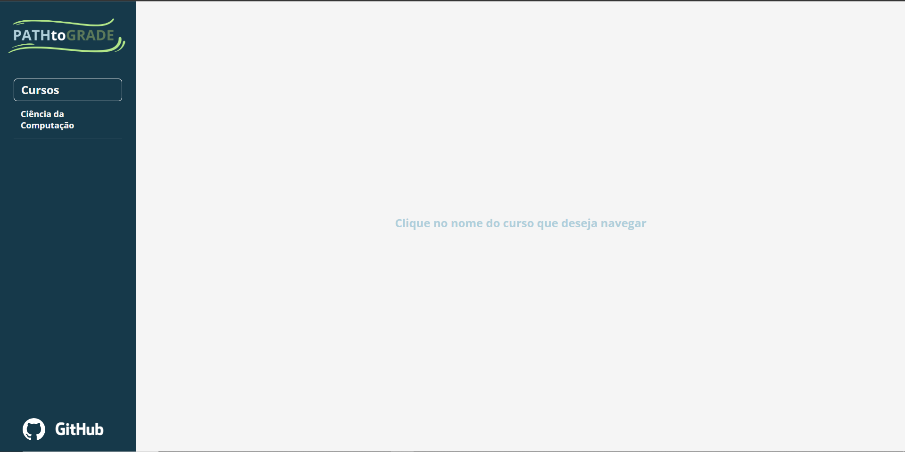

# PATHtoGRADE

Este é um aplicativo desenvolvido para Desktop Web proporcionando aos estudantes universitários uma facilidade maior ao planejarem as matérias que irão fazer a cada semestre.

## Funcionalidades

É um aplicativo simples e intuitivo, ao abri-lo você irá se deparar com a seguinte tela:
  

Onde na esquerda você pode ver todos os cursos cadastrados no sistema e clicar no qual deseja navegar. Ao selecionar um curso vai ser listado por período cada matéria presente no curso, da seguinte forma:

É possível utilizar o scroll do mouse ou clicar na barra na parte inferior da tela, para navegar para a direita e ver os restante dos períodos.

Digamos que nesse caso onde o curso de Ciência da Computação foi o escolhido, eu queira saber todas as displinas relacionadas (que fazem parte do mesmo "caminho") com a disciplina de Técnicas de Busca e Ordenação. Basta eu clicar na caixa da disciplina, que deverá ser apresentado as relações da seguinte maneira:

Caso queira retornar ao padrão, há um botão na inferior esquerda escrito "Voltar". Ou então basta clicar em outra disciplina que gostaria de navegar.

## Técnologias Utilizadas

### Ferramenta de Automação de Compilação

Foi utilizado o **Maven** que é uma ferramenta de automação de compilação usada principalmente para projetos **Java**. Ela é projetada para simplificar o processo de construção do projeto (build), incluindo compilação, distribuição, documentação, entre outros, através do uso de um arquivo de configuração chamado **pom.xml** (Project Object Model). 

### Back-End

O back-end foi desenvolvido em **Java**, com o framework **Spring** junto com sua extensão **Spring Boot** que simplifica o processo de configuração e publicação. Além de utilizar o framework **JUnit5** para aplicação de testes unitários e o **Mockito** para os testes utilizando mocks, que foram utilizados para a controladora.

### Front-End

Para o front-end, como é uma aplicação simples de apenas uma tela, foi utilizado **HTML** e **CSS**, juntamente com **Javascript** puro e a biblioteca **Axios** para fazer requisições HTTP.

## Desenvolvedores

[Miguel Vieira Machado Pim](https://github.com/MiguelPim01)  
[Pedro Henrique Bravim Duarte](https://github.com/PhenBD)

### PROJETO-INTEGRADO-I
Aplicação desenvolvida para a disciplina de Projeto Integrado I
